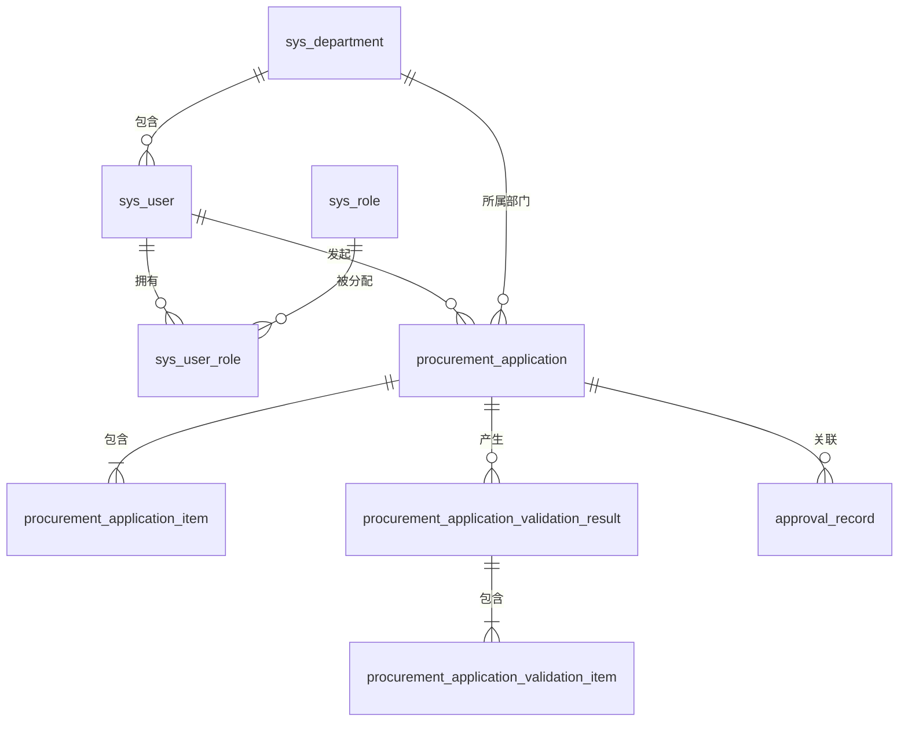

# 采购申请模块最小数据库设计

## 1. 设计范围

本期只覆盖采购申请主链路：

```text
申请人发起申请 -> 采购申请校验智能体 -> 审批人审批 -> 流转到寻源与比价
```

本设计先不包含供应商、报价单、采购订单、验收、发票等表，后续模块在现有基础上扩展。

## 2. 设计约定

- 数据库默认使用 PostgreSQL 14+。
- MySQL 版本同步提供，SQL 位于 `sql/mysql`。
- 主键统一使用 `BIGINT` 自增主键。
- 所有表包含 `created_at`、`updated_at`。
- 业务主数据表包含 `deleted_at`，使用软删除。
- 金额字段使用 `NUMERIC(18,2)`，数量使用 `NUMERIC(18,4)`。
- 状态字段使用 `VARCHAR` + `CHECK`，避免后续扩展枚举时频繁改表。
- 智能体结构化输出保留一份原始 JSON，便于审计和模型版本回溯。

## 3. 表清单

| 序号 | 表名 | 说明 |
|---|---|---|
| 1 | sys_department | 部门 |
| 2 | sys_user | 用户 |
| 3 | sys_role | 角色 |
| 4 | sys_user_role | 用户角色关系 |
| 5 | procurement_application | 采购申请主表 |
| 6 | procurement_application_item | 采购申请明细 |
| 7 | procurement_application_validation_result | 智能校验结果主表 |
| 8 | procurement_application_validation_item | 智能校验明细 |
| 9 | approval_record | 通用审批记录 |

## 4. 表关系



## 5. 核心状态枚举

### 5.1 采购申请状态

| 枚举值 | 含义 |
|---|---|
| DRAFT | 草稿 |
| SUBMITTED | 已提交 |
| VALIDATING | 智能校验中 |
| PENDING_APPROVAL | 待审批 |
| APPROVED | 已通过 |
| REJECTED | 已驳回 |
| WITHDRAWN | 已撤回 |

### 5.2 风险等级

| 枚举值 | 含义 |
|---|---|
| LOW | 低风险 |
| MEDIUM | 中风险 |
| HIGH | 高风险 |

### 5.3 校验结果

| 枚举值 | 含义 |
|---|---|
| PASS | 通过 |
| NEED_REVIEW | 建议人工重点审核 |
| REJECT | 建议驳回 |
| NA | 不适用 |

## 6. 关键表字段说明

### 6.1 procurement_application

| 字段 | 类型 | 必填 | 说明 |
|---|---|---|---|
| id | BIGINT | 是 | 主键 |
| application_no | VARCHAR(64) | 是 | 申请单号，唯一 |
| title | VARCHAR(255) | 是 | 申请标题 |
| applicant_id | BIGINT | 是 | 申请人用户 ID |
| department_id | BIGINT | 是 | 申请部门 ID |
| application_type | VARCHAR(32) | 是 | 申请类型，如 NORMAL、URGENT |
| purpose | TEXT | 否 | 采购用途说明 |
| budget_account_code | VARCHAR(64) | 否 | 预算科目编码 |
| budget_account_name | VARCHAR(128) | 否 | 预算科目名称 |
| budget_available_amount | NUMERIC(18,2) | 否 | 预算可用金额 |
| total_amount | NUMERIC(18,2) | 否 | 申请总金额 |
| currency | CHAR(3) | 是 | 币种，默认 CNY |
| required_date | DATE | 否 | 需求日期 |
| risk_level | VARCHAR(16) | 否 | LOW/MEDIUM/HIGH |
| status | VARCHAR(32) | 是 | 当前状态 |
| submitted_at | TIMESTAMPTZ | 否 | 提交时间 |
| approved_at | TIMESTAMPTZ | 否 | 通过时间 |
| rejected_at | TIMESTAMPTZ | 否 | 驳回时间 |
| withdrawn_at | TIMESTAMPTZ | 否 | 撤回时间 |
| version | INTEGER | 是 | 乐观锁版本号 |
| created_by | BIGINT | 否 | 创建人 |
| updated_by | BIGINT | 否 | 更新人 |
| created_at | TIMESTAMPTZ | 是 | 创建时间 |
| updated_at | TIMESTAMPTZ | 是 | 更新时间 |
| deleted_at | TIMESTAMPTZ | 否 | 删除时间 |

### 6.2 procurement_application_validation_result

| 字段 | 类型 | 必填 | 说明 |
|---|---|---|---|
| id | BIGINT | 是 | 主键 |
| application_id | BIGINT | 是 | 采购申请 ID |
| agent_task_id | VARCHAR(64) | 否 | 智能体任务 ID |
| model_name | VARCHAR(128) | 否 | 模型名称 |
| model_version | VARCHAR(64) | 否 | 模型版本 |
| overall_risk_level | VARCHAR(16) | 否 | 总体风险等级 |
| overall_result | VARCHAR(32) | 否 | PASS/NEED_REVIEW/REJECT |
| summary | TEXT | 否 | 校验摘要 |
| suggestion | TEXT | 否 | 处理建议 |
| confidence | NUMERIC(5,4) | 否 | 置信度，如 0.9200 |
| raw_result | JSONB/JSON | 否 | 智能体原始输出 |
| executed_at | TIMESTAMPTZ | 否 | 执行时间 |
| created_at | TIMESTAMPTZ | 是 | 创建时间 |
| updated_at | TIMESTAMPTZ | 是 | 更新时间 |

### 6.3 approval_record

| 字段 | 类型 | 必填 | 说明 |
|---|---|---|---|
| id | BIGINT | 是 | 主键 |
| business_type | VARCHAR(64) | 是 | 业务类型，如 PURCHASE_APPLICATION |
| business_id | BIGINT | 是 | 业务单 ID |
| node_code | VARCHAR(64) | 否 | 节点编码 |
| node_name | VARCHAR(128) | 否 | 节点名称 |
| operator_id | BIGINT | 是 | 操作人 ID |
| operator_name | VARCHAR(128) | 否 | 操作人姓名快照 |
| role_code | VARCHAR(64) | 否 | 操作角色编码 |
| action | VARCHAR(32) | 是 | SUBMIT/APPROVE/REJECT/WITHDRAW 等 |
| comment | TEXT | 否 | 审批意见 |
| from_status | VARCHAR(32) | 否 | 操作前状态 |
| to_status | VARCHAR(32) | 否 | 操作后状态 |
| approved_at | TIMESTAMPTZ | 否 | 审批时间 |
| created_at | TIMESTAMPTZ | 是 | 创建时间 |
| updated_at | TIMESTAMPTZ | 是 | 更新时间 |

## 7. 索引设计

### 7.1 采购申请主表

- `uk_procurement_application_application_no`：申请单号唯一索引
- `idx_procurement_application_applicant_id`：申请人索引
- `idx_procurement_application_department_id`：部门索引
- `idx_procurement_application_status`：状态索引
- `idx_procurement_application_created_at`：创建时间索引

### 7.2 采购申请明细

- `uk_procurement_application_item_line`：`application_id + line_no` 唯一
- `idx_procurement_application_item_material_code`：物料编码索引

### 7.3 智能校验结果

- `idx_validation_result_application_id`：申请单索引
- `idx_validation_result_risk_level`：风险等级索引

### 7.4 智能校验明细

- `uk_validation_item_result_code`：`validation_result_id + item_code` 唯一
- `idx_validation_item_result_id`：校验结果索引

### 7.5 审批记录

- `idx_approval_record_business`：`business_type + business_id`
- `idx_approval_record_operator_id`：操作人索引
- `idx_approval_record_created_at`：创建时间索引

## 8. 建议的落库顺序

1. 先执行 PostgreSQL/MySQL 建表 SQL。
2. 插入部门、用户、角色基础数据。
3. 创建采购申请接口。
4. 智能体校验结果写入 `validation_result` 和 `validation_item`。
5. 审批动作写入 `approval_record`。

## 9. 后续扩展建议

下一阶段增加采购寻源时，可以继续新增：

- `supplier`
- `quotation`
- `quotation_item`
- `comparison_report`
- `purchase_order`
- `purchase_order_item`

采购申请模块已经预留了 `application_no` 作为后续订单、比价、验收、发票追溯的主关联键。
